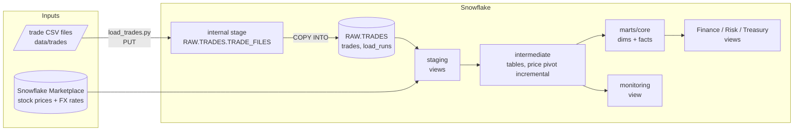
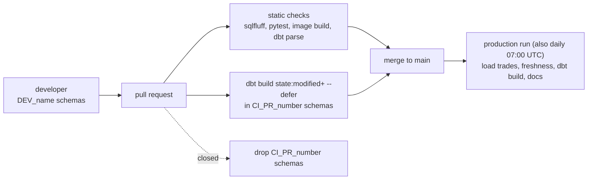

# Trading PnL on Snowflake with dbt

[](https://github.com/Grechenish/snowflake-dbt-trading-pnl/actions/workflows/ci.yml)
[](https://github.com/Grechenish/snowflake-dbt-trading-pnl/actions/workflows/dbt-daily.yml)

A small daily batch data platform on Snowflake. A Python loader ingests versioned trade files
into a raw layer; dbt Core joins them with free Marketplace market data and FX rates and
publishes daily profit-and-loss (PnL) for Finance, Risk and Treasury. Pull requests are built and
tested on Snowflake in their own schemas before they can reach production.

It is a learning and portfolio project: the trades are synthetic, there are two trading books,
and everything runs on XSMALL warehouses. The point is the engineering around the data:
ingestion that is safe to re-run, incremental processing where it pays off, tests that separate
"stop" from "look at this", least-privilege access, and CI against the real warehouse.

## Architecture





| Layer | Models | What happens there |
|---|---|---|
| RAW | `RAW.TRADES.TRADES`, `LOAD_RUNS` | Every row of every trade file, as text, with file name, row number and load run. Never updated. |
| Staging | `stg_trades__trade_versions`, `stg_public_data__stock_prices`, `stg_public_data__fx_rates` | Rename, cast to fixed-point types, collapse replayed trade rows. Views. |
| Intermediate | `int_stock_prices_daily` (incremental), `int_trades_current`, `int_daily_position`, `int_instrument_prices_filled`, `int_trading_pnl` | Pivot prices, apply amendments and cancellations, carry positions over the trading calendar, mark to market. |
| Marts | `dim_date`, `dim_security`, `dim_book`, `fct_stock_history` (incremental), `fct_trading_pnl` | The shared calendar, dimensions and the two facts. |
| Department marts | `finance_book_pnl_daily`, `risk_position_exposure_daily`, `treasury_cash_balance_daily` | What each team reads, rounded once after aggregating. Views. |
| Monitoring | `monitoring_market_data_daily` | Market-data completeness per day. |

## Data sources

- **Market data:** the free *Snowflake Public Data (Free)* Marketplace listing: daily Nasdaq
  prices for about 10,000 US-listed securities in a long one-row-per-variable format, and daily FX
  rates. The free listing runs about 90 days behind.
- **Trades:** synthetic CSV files in [`data/trades`](data/trades/README.md), standing in for an
  order-management system's daily export. They include an amendment, a cancellation, a
  back-dated trade and a file resent under a new name.
- **Reference data:** the `books` seed (book, desk, reporting currency).

## Key engineering decisions

Each one is explained, with the alternatives, in [docs/decisions.md](docs/decisions.md).

- **Ingestion is idempotent at two levels.** `COPY INTO` remembers which files it loaded and skips
  them; staging keeps one row per `(trade_id, version)`, so even a file resent under a new name is
  counted once. A replay that *differs* from the original fails the build instead of being picked
  arbitrarily.
- **Incremental only where the cost is.** The PnL fact is a plain table: it is small, every row
  depends on the whole trade history, and its inputs are rebuilt anyway. The ~35M-row price pivot
  is incremental, merging a lookback window on `(ticker, trade_date)`. Adjusted prices were
  dropped because a split rewrites them for all history, which no lookback window can follow.
- **One trading calendar.** Positions are carried over a shared `dim_date`, prices are carried
  forward over missing days, and `price_age_days` tells consumers how stale each valuation is.
- **Money is never FLOAT.** Source FLOATs are cast to `NUMBER` in staging and rounded only in the
  department marts, after aggregation.
- **Least privilege.** Five roles, one key-pair service user per automated process, no `GRANT ALL`.
  CI and developers can read production but cannot write to it.

## Data quality

Tests are tiered by what should happen when they fail:

| Tier | Mechanism | Examples |
|---|---|---|
| **Block** | test severity `error`: the build stops, nothing downstream is published | conflicting trade replays, broken version sequences, trades on non-trading days, Treasury cash not reconciling to the trades, Finance not reconciling to Treasury, >20% of the newest market day missing closes |
| **Warn** | severity `warn`: the run stays green and the warning is in the run summary | stale prices (`price_age_days` > 5), trades newer than the market data, overnight moves above 40% (a possible unadjusted split), restatements older than the incremental window, >1% missing closes |
| **Observe** | no test; measured for people to read | `monitoring_market_data_daily`, the restatement-depth analysis in the daily log |

Rows the market data delivers without a close price are kept and counted, not filtered out
before a test can see them. Unit tests cover the incremental branch, amendments and
cancellations, replay deduplication, the forward fill and the PnL arithmetic.

## Performance

`fct_stock_history` took about 10 s **on every warehouse size**: its `ASOF JOIN` had no `ON`
key, so all 3.9M rows formed one partition processed on one node. Looking up FX once per trading
day (374 rows) and equi-joining the prices to that made it 2.8× faster on XSMALL (9.6 s → 3.4 s),
with a two-way `MINUS` showing identical output. The same measurements showed that a LARGE
warehouse saved about 4 seconds a day for most of the run's cost, so everything runs on XSMALL.
[Full write-up](docs/PERFORMANCE.md). These numbers were measured before the refactor described
here and have not been re-measured since.

## Security

Set up by the idempotent scripts in [`snowflake/`](snowflake/README.md):

| Role | Used by | Can |
|---|---|---|
| `loader` | `svc_loader` | PUT to the trade stage, insert into `RAW.TRADES` |
| `transformer_prod` | `svc_dbt_prod` | read RAW and the Marketplace share, build `ANALYTICS` |
| `transformer_ci` | `svc_dbt_ci` | the same reads plus production, build `ANALYTICS_DEV.CI_PR_<n>` |
| `developer` | people | like CI, in `ANALYTICS_DEV.DEV_<name>` |
| `reporter` | people, BI tools | read the production marts |

Service users are `TYPE = SERVICE` with RSA key-pair authentication; people log in as
themselves. Every warehouse is XSMALL with 60 s auto-suspend and a statement timeout, under a
monthly resource monitor.

## How to run

**One-time setup** (Snowflake account admin): install the *Snowflake Public Data (Free)* listing,
run `snowflake/01`–`05` in order, then add the GitHub secrets listed in
[docs/CI_CD.md](docs/CI_CD.md).

**Local development**, in a virtualenv with your own Snowflake user (holding the `developer` role):

```bash
pip install -r requirements.txt -r requirements-dev.txt
cp .env.example .env                    # SNOWFLAKE_ACCOUNT, SNOWFLAKE_USER
set -a && source .env && set +a
cd trading_pnl && dbt deps
dbt build                                # builds ANALYTICS_DEV.DEV_<YOU>, logs in through the browser
```

**Tests that need no Snowflake:**

```bash
pytest                                       # the loader
python ingestion/load_trades.py --dry-run    # checks the trade files
sqlfluff lint trading_pnl/models trading_pnl/tests trading_pnl/analyses   # from requirements-lint.txt
```

Production runs only in GitHub Actions. Operating it (reruns, full refreshes, stale data,
rollbacks) is covered in [docs/RUNBOOK.md](docs/RUNBOOK.md).

## Limitations

- **Verified on Snowflake on 2 Oct 2026** by one production run (loader, freshness, every model
  and data test) and one pull-request build (all models, data tests and unit tests in a CI
  schema). Not run there yet: a production run on top of existing data, the CI path that defers
  to production (it needs a production manifest from `main`), and the CI schema cleanup. The
  performance numbers come from the earlier version.
- Trades are synthetic and few; prices in them are illustrative.
- The free market data lags about 90 days, so recent trades wait for prices
  (`assert_trades_within_market_data` lists them).
- Prices are unadjusted and corporate actions (splits, dividends) are out of scope; a warning
  flags suspicious jumps instead.
- The incremental lookback window is provisional until enough restatement evidence is collected.
- Files land in the repository rather than cloud storage, and there is no CDC from a real
  order-management system.
- One Snowflake account for every environment; isolation is by database, schema and role.
- Department marts are views, so they show a new `fct_trading_pnl` the moment it is rebuilt, even
  if a test on it then fails.

## Origin

This started from Snowflake's
[Accelerating Data Teams with dbt Core & Snowflake](https://quickstarts.snowflake.com/guide/data_teams_with_dbt_core/index.html)
quickstart: the PnL idea, the two hand-made trade books and the Finance/Risk/Treasury views come
from it. The quickstart's Knoema dataset is no longer on the Marketplace, so the sources were
rebuilt on *Snowflake Public Data (Free)*. Everything else, including the ingestion, the
incremental design, the calendar and FX logic, the tests, CI, the Snowflake roles and the
performance work, was built on top. The quickstart's heavy-warehouse routing and resize hooks
were tried, measured and removed.

## Documentation

| Document | Contents |
|---|---|
| [docs/decisions.md](docs/decisions.md) | Every major design decision, the options and the trade-offs |
| [docs/PERFORMANCE.md](docs/PERFORMANCE.md) | The ASOF JOIN investigation and the cost model |
| [docs/CI_CD.md](docs/CI_CD.md) | How pull requests and production runs work, and how to set them up |
| [docs/RUNBOOK.md](docs/RUNBOOK.md) | Operating the pipeline: failures, reruns, full refreshes, recovery |
| [snowflake/README.md](snowflake/README.md) | Account setup and the permission model |
| [data/trades/README.md](data/trades/README.md) | The trade files and the scenarios they contain |
| [dbt docs site](https://grechenish.github.io/snowflake-dbt-trading-pnl/) | Model and column docs with the lineage graph, published by the daily run |
