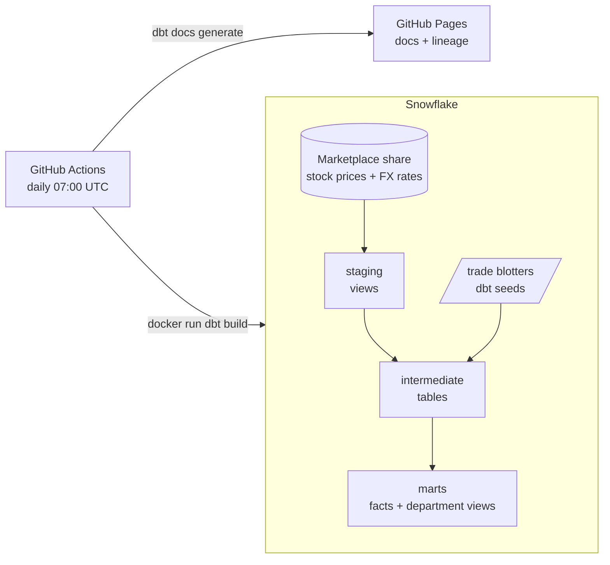

# Trading PnL and stock history on Snowflake with dbt Core

[](https://github.com/Grechenish/snowflake-dbt-trading-pnl/actions/workflows/ci.yml)
[](https://github.com/Grechenish/snowflake-dbt-trading-pnl/actions/workflows/dbt-daily.yml)

A production-style analytics engineering pipeline. dbt Core transforms free Snowflake Marketplace market data inside a Docker image, and GitHub Actions builds, tests and documents it every day.

It produces two things:

- **Daily stock history** for about 10,000 US-listed securities, with close prices in USD, EUR and GBP.
- **A trading profit-and-loss (PnL) mart** for two hand-maintained trading desks, with separate views for Finance, Risk and Treasury.

The models, columns and lineage graph are browsable on the **[dbt docs site](https://grechenish.github.io/snowflake-dbt-trading-pnl/)**, which the daily workflow republishes after each successful build.

## How it works



| Layer | What happens | Materialization |
|---|---|---|
| Staging | Renames columns and filters the Marketplace views to the load window | views |
| Intermediate | Pivots prices from long to wide, unions the trade blotters, builds a daily position calendar and marks positions to market | tables |
| Marts | Stock history in three currencies, the PnL fact, and the Finance, Risk and Treasury views | tables, one incremental fact, views |

## Engineering highlights

- **Found and fixed a parallelism bottleneck.** `fct_stock_history` took about 10 s on *every* warehouse size, because an `ASOF JOIN` without an `ON` key runs as a single partition on one node. Looking up FX rates once per trading day and equi-joining the 3.9 M price rows made it 2.8× faster on the smallest warehouse. A `MINUS` in both directions proved the output identical. [Details](docs/PERFORMANCE.md#4-warehouse-size-benchmark-and-the-fct_stock_history-fix)
- **Measured cost, then acted on it.** A query-tag macro labels every Snowflake query with the dbt node that ran it, which gives per-model timings from query history. They showed that a dedicated LARGE warehouse cost most of each run to save about 4 seconds, so it is now opt-in. [Cost model](docs/PERFORMANCE.md#5-cost-of-the-daily-run)
- **Tests at every layer.** Grain, referential-integrity, accepted-value and range tests cover every model, alongside two custom SQL tests and unit tests that check the position and PnL logic against hand-computed fixtures. `dbt build` skips everything downstream of a failing test, so bad data doesn't reach the marts.
- **An incremental fact with a safety net.** The PnL fact re-merges only the last 7 days. An equality test against its source fails the build if a back-dated trade edit leaves it stale, and the daily workflow has a full-refresh switch to repair it.
- **Built around the data's quirks.** FX rates aren't published on every US trading day, so each day uses the latest rate on or before it. The free feed runs about 90 days behind, so the freshness checks are tuned to that lag.
- **Reproducible and safe to run.** Every Python dependency is locked, and the Docker image runs as a non-root user with no credentials inside. Every pull request must build the image and parse the project without warnings.

## Changes compared with the Snowflake quickstart

The project follows [Snowflake's dbt Core quickstart](https://quickstarts.snowflake.com/guide/data_teams_with_dbt_core/index.html#0) as a pattern, then goes further:

- The quickstart's Knoema dataset is no longer on the Marketplace. The source layer is rebuilt on **Snowflake Public Data (Free)**, which delivers prices in a long, one-row-per-variable format that has to be pivoted.
- The models are restructured into staging, intermediate and marts layers that follow dbt's naming conventions.
- Added: the test suite, unit tests, source freshness checks, query tagging, and the incremental fact's equality test.
- The FX join bottleneck is fixed, and the LARGE warehouse is opt-in after measuring its cost.
- Everything is packaged in Docker and scheduled with GitHub Actions, with CI checks and a published docs site.
- Operating documentation covers onboarding, architecture, every model and performance.

## Tech stack

| Tool | Role |
|---|---|
| dbt Core 1.12, dbt-snowflake 1.12, dbt_utils 1.4 | Transformations, tests and docs |
| Snowflake | Warehouse. The Marketplace listing *Snowflake Public Data (Free)* is the source. |
| Docker (`python:3.14-slim`) | Runtime image, used locally and in CI |
| GitHub Actions | Daily production build, pull-request checks, docs site on GitHub Pages |

## Quick start

You need a Snowflake account where the [bootstrap script](docs/SYSTEM_OVERVIEW.md#35-bootstrap-script) has run once and the *Snowflake Public Data (Free)* listing is installed.

```bash
cp .env.example .env          # then fill in SNOWFLAKE_ACCOUNT and SNOWFLAKE_PASSWORD
docker build -t trading-pnl .
docker run --rm --env-file .env trading-pnl build --target dev
```

The [developer guide](docs/README.md) covers the local virtual-environment workflow, every command and troubleshooting.

## Documentation

| Document | Contents |
|---|---|
| [Developer guide](docs/README.md) | Setup, environment variables, running the pipeline, common tasks, troubleshooting |
| [System overview](docs/SYSTEM_OVERVIEW.md) | Docker, CI, Snowflake objects and the dbt layering |
| [Models dictionary](docs/MODELS_DICTIONARY.md) | Every model's purpose, logic and tests |
| [Performance validation](docs/PERFORMANCE.md) | Benchmarks, the bottleneck fix and the cost model |
| [dbt docs site](https://grechenish.github.io/snowflake-dbt-trading-pnl/) | Searchable model and column docs with the lineage graph |

## Background

This is a learning project about deploying a dbt platform from scratch. It covers setting up dbt Core with Snowflake, running transformations reliably on a schedule, and packaging the whole system in Docker. Useful material along the way:

- [dbt Fundamentals course](https://courses.getdbt.com/courses/fundamentals)
- [dbt best practices](https://docs.getdbt.com/best-practices)
- [Jinja, macros and packages course](https://courses.getdbt.com/courses/jinja-macros-packages)
