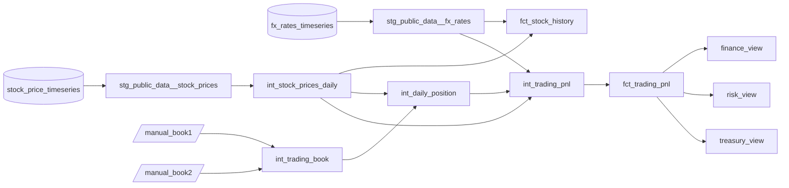

# Data Models Dictionary

This is a reference for every node in the `dbt_hol` project: 2 sources, 2 seeds, 11 models and 2 singular tests. For each one it gives the business purpose, how it's materialized, its lineage, its key logic and the tests that guard it.

The layering approach, schemas and warehouses are explained in [SYSTEM_OVERVIEW.md](SYSTEM_OVERVIEW.md). Runtimes and sizing are in [PERFORMANCE.md](PERFORMANCE.md).

**Conventions used below**

- Object names are written as dbt names them. In Snowflake they appear in upper case, for example `DBT_HOL_PROD.MARTS.FCT_TRADING_PNL`.
- **Grain** means the set of columns that uniquely identifies one row.
- Row counts are from the dev build on 2026-10-01, with `start_date = 2025-01-01`.
- Variables referenced: `start_date`, `report_currencies` (default `['EUR', 'GBP']`), `pnl_lookback_days` (default `7`) and `heavy_warehouse_size` (default `'SMALL'`).

---

## Contents

| # | Node | Layer | Materialization | Rows |
|---|---|---|---|---|
| S1 | [`public_data.stock_price_timeseries`](#s1-public_datastock_price_timeseries) | source | Marketplace view | ~168 M (all history) |
| S2 | [`public_data.fx_rates_timeseries`](#s2-public_datafx_rates_timeseries) | source | Marketplace view | ~48.7 M (all pairs) |
| D1 | [`manual_book1`](#d1-manual_book1) | seed | table | 7 |
| D2 | [`manual_book2`](#d2-manual_book2) | seed | table | 5 |
| 1 | [`stg_public_data__stock_prices`](#1-stg_public_data__stock_prices) | staging | view | 35,013,962 |
| 2 | [`stg_public_data__fx_rates`](#2-stg_public_data__fx_rates) | staging | view | 764 (382 days × 2) |
| 3 | [`int_stock_prices_daily`](#3-int_stock_prices_daily) | intermediate | table | 3,890,440 |
| 4 | [`int_trading_book`](#4-int_trading_book) | intermediate | table | 12 |
| 5 | [`int_daily_position`](#5-int_daily_position) | intermediate | table | 1,495 |
| 6 | [`int_trading_pnl`](#6-int_trading_pnl) | intermediate | table | 1,495 |
| 7 | [`fct_stock_history`](#7-fct_stock_history) | marts | table | 3,890,440 |
| 8 | [`fct_trading_pnl`](#8-fct_trading_pnl) | marts | incremental (merge) | 1,495 |
| 9 | [`fct_trading_pnl_finance_view`](#9-fct_trading_pnl_finance_view) | marts | view | — |
| 10 | [`fct_trading_pnl_risk_view`](#10-fct_trading_pnl_risk_view) | marts | view | — |
| 11 | [`fct_trading_pnl_treasury_view`](#11-fct_trading_pnl_treasury_view) | marts | view | — |
| T1 | [`assert_trades_on_trading_days`](#t1-assert_trades_on_trading_days) | singular test | — | — |
| T2 | [`assert_risk_view_shares_sum_to_one`](#t2-assert_risk_view_shares_sum_to_one) | singular test | — | — |

### Lineage



---

## Sources

Sources are declared in `models/staging/_sources.yml` under the source name `public_data`, which points to `SNOWFLAKE_PUBLIC_DATA_FREE.PUBLIC_DATA_FREE`. Both objects are secure views in a read-only Marketplace share. They are only ever read by the staging layer.

**Freshness:** both sources are checked with `dbt source freshness`, configured at source level in `_sources.yml`.

| Setting | Value |
|---|---|
| `loaded_at_field` | `date::timestamp_ntz`, the newest data date in each source |
| `warn_after` | 100 days |
| `error_after` | 150 days |

The free listing runs about 90 days behind by design. On 2026-10-01 the newest date was 2026-07-02, 91 days earlier. So a warning means the feed is slipping, and an error means it has most likely stopped. The daily GitHub Actions job runs this check after the build.

### S1. `public_data.stock_price_timeseries`

- **Business purpose:** daily prices and trading volumes for US securities traded on Nasdaq (equities and ETFs), sourced from Nasdaq TotalView. This is the market data that the stock history and trade valuation are built from.
- **Shape:** long (entity-attribute-value) format. Each row holds one `(ticker, date, variable, value)`. There are 9 variables: pre-market open, all-day high, all-day low and post-market close, each also as a split/dividend-adjusted version, plus `nasdaq_volume`.
- **Coverage:** from 2018-05-01 to about three months before today (2026-07-02 at the time of writing). Each variable has about 18.6 M rows.
- **Used by:** `stg_public_data__stock_prices`.
- **Known data quirks:**
  - A few rows have a volume but no prices. On 2025-01-06, two such rows appeared for PSTR and DSS. They're removed in `int_stock_prices_daily`.
  - `event_timestamp_utc` is always null and isn't used.

### S2. `public_data.fx_rates_timeseries`

- **Business purpose:** daily foreign-exchange rates for about 26,000 currency pairs, from the ECB, BIS, IMF and several national central banks. They're used to express USD prices in the desks' reporting currencies.
- **Shape:** one row per `(base_currency_id, quote_currency_id, date)`. `value` holds how many units of the quote currency one unit of the base currency buys; for example, `USD/EUR = 0.8773`. `provenance` is a JSON object recording the source and whether the rate was published directly or calculated.
- **Coverage:** from 1940 to about three months before today. **Rates aren't published on every US trading day**, because ECB holidays differ from US market holidays.
- **Used by:** `stg_public_data__fx_rates`.

---

## Seeds

Seeds live in `seeds/` and load into the `SEEDS` schema. Column types are fixed in `seeds/_seeds.yml`:

| Column | Type |
|---|---|
| `trade_date` | `date` |
| `quantity` | `number(38,0)` |
| `price_per_share` | `number(18,4)` |

Both seeds have the same columns:

| Column | Meaning |
|---|---|
| `book` | Trading desk / book identifier |
| `trade_date` | Date the trade was executed. It must be a trading day for the instrument (see test T1). |
| `trader` | Trader who booked the trade |
| `instrument` | Stock ticker, which must exist in the price data |
| `action` | `BUY` or `SELL` |
| `quantity` | Number of shares, always positive. The direction comes from `action`. |
| `price_per_share` | Execution price in the book's currency |
| `currency` | Book currency (`GBP` or `EUR`) |

### D1. `manual_book1`

- **Business purpose:** the GBP desk's trade blotter (Book1, traders Jeff A. and Nick Z.). It's maintained by hand, standing in for an order-management-system feed.
- **Content:** 7 trades in AAPL, NVDA and MSFT between 2025-01-15 and 2026-06-01. The prices are the real GBP close prices for each trade date.
- **Downstream:** `int_trading_book`.
- **Tests:** none on the seed itself. Every column is validated after the union, in `int_trading_book`.

### D2. `manual_book2`

- **Business purpose:** the EUR desk's trade blotter (Book2, trader Tina M.).
- **Content:** 5 trades in MSFT, NVDA and AAPL between 2025-01-15 and 2026-04-15, at real EUR close prices.
- **Downstream:** `int_trading_book`.
- **Tests:** validated in `int_trading_book`.

> **Changing a seed:** edit the CSV and run `dbt build`. If you changed a trade dated more than `pnl_lookback_days` (7) days before the latest data, run `dbt build --full-refresh -s fct_trading_pnl` once, because the incremental fact only reprocesses recent days.

---

## Staging layer

**Applies to every staging model:**

| | |
|---|---|
| Materialization | `view` (folder default) |
| Schema | `STAGING` |
| Warehouse | target default (XSMALL) |
| Reads | sources only. No joins and no aggregation. |

**Why views:** staging only renames and filters columns. A view costs no storage, always shows the latest source data, and Snowflake pushes its filters down into whatever reads it. Saving a copy of tens of millions of rows would gain nothing.

### 1. `stg_public_data__stock_prices`

- **Layer:** staging. File: `models/staging/stg_public_data__stock_prices.sql`.
- **Business purpose:** the stock market price data, limited to the reporting window and given consistent column names. It's still in long format (one row per variable).
- **Grain:** `ticker` × `trade_date` × `variable`.
- **Columns:** `ticker`, `asset_class`, `primary_exchange_code`, `primary_exchange_name`, `variable`, `trade_date` (renamed from `date`), `value`.
- **Lineage:**
  - Upstream: S1 `stock_price_timeseries`.
  - Downstream: `int_stock_prices_daily`.
- **Key transformations:**
  - Renames `date` to `trade_date`.
  - Filters on `date >= var('start_date')`. This one filter controls data volume and cost for everything downstream.
- **Tests:**

  | Scope | Test | Rule enforced |
  |---|---|---|
  | model | `dbt_utils.unique_combination_of_columns` on `ticker`, `trade_date`, `variable` | The source has no duplicate measurements. The `MAX()` pivot downstream would otherwise hide them silently. |
  | `ticker` | `not_null` | Every row is attributed to a security |
  | `trade_date` | `not_null` | Every row is dated |
  | `variable` | `not_null`, `accepted_values` (the 9 known variables) | Fails if the provider adds or renames a variable, which would otherwise disappear silently from the pivot downstream |

### 2. `stg_public_data__fx_rates`

- **Layer:** staging. File: `models/staging/stg_public_data__fx_rates.sql`.
- **Business purpose:** daily rates for converting USD into each reporting currency.
- **Grain:** `quote_currency` × `rate_date` (the base currency is always USD).
- **Columns:** `base_currency`, `quote_currency`, `quote_currency_name`, `rate_date`, `fx_rate`, `rate_source`, `rate_type`.
- **Lineage:**
  - Upstream: S2 `fx_rates_timeseries`.
  - Downstream: `fct_stock_history`, `int_trading_pnl`.
- **Key transformations:**
  - Filters to `base_currency_id = 'USD'` and `quote_currency_id` in `var('report_currencies')`. The `IN` list is built by Jinja from the variable, so adding a currency only means editing `dbt_project.yml`.
  - Filters on `date >= var('start_date')`.
  - Extracts `provenance:source` and `provenance:rate_type` from the JSON column, giving the publisher (for example `ECB`) and how the rate was produced (for example `Derived Inverse` or `Derived Cross`).
- **Tests:**

  | Scope | Test | Rule enforced |
  |---|---|---|
  | model | `dbt_utils.unique_combination_of_columns` on `quote_currency`, `rate_date` | One rate per currency per day. Without this, joins downstream would duplicate price rows. |
  | `fx_rate` | `not_null` | No missing rates in the range used |

---

## Intermediate layer

**Applies to every intermediate model:**

| | |
|---|---|
| Materialization | `table` (folder default) |
| Schema | `INTERMEDIATE` |
| Warehouse | `+snowflake_warehouse` uses `DBT_PROD_HEAVY_WH` when the target is prod and `DBT_DEV_HEAVY_WH` otherwise (both LARGE) |

**Why tables:** each intermediate model is read by several later models and tests. The stock pivot in particular would be expensive to recompute every time it's queried. Building them as tables means each runs once per build.

**Why the heavy warehouse:** this follows section 21 of the Snowflake quickstart guide. [PERFORMANCE.md](PERFORMANCE.md) shows that at today's data size this setup costs more than it saves. It's kept on purpose, to demonstrate the pattern.

### 3. `int_stock_prices_daily`

- **Layer:** intermediate. File: `models/intermediate/int_stock_prices_daily.sql`.
- **Business purpose:** the daily trading record for each security, with open, high, low and close prices in USD plus volume. This is the core market-data table the rest of the project relies on.
- **Grain:** `ticker` × `trade_date`.
- **Columns:**

  | Column | Meaning |
  |---|---|
  | `ticker`, `trade_date` | Grain |
  | `asset_class`, `primary_exchange_name` | Descriptive attributes |
  | `open_price` | From `pre-market_open` |
  | `high_price` | From `all-day_high` |
  | `low_price` | From `all-day_low` |
  | `close_price` | From `post-market_close` |
  | `close_price_adjusted` | From `post-market_close_adjusted` |
  | `volume` | From `nasdaq_volume`, cast to `number(38,0)` |

- **Lineage:**
  - Upstream: `stg_public_data__stock_prices`.
  - Downstream: `fct_stock_history`, `int_daily_position`, `int_trading_pnl`.
  - It's also referenced by the `relationships` test on `int_trading_book` and by test T1.
- **Key transformations:**
  - **Pivot from long to wide:** `GROUP BY ticker, trade_date` with `MAX(CASE WHEN variable = '…' THEN value END)` for each measure. This turns about 35 M rows into 3.9 M.
  - The descriptive attributes are the same for every variable, so they're carried through with `ANY_VALUE`.
  - **Data-quality filter:** `HAVING close_price IS NOT NULL` drops the volume-only rows in the source (see S1). This was added after the `not_null` test on `close_price` caught two such rows.
  - The adjusted open, high and low variables aren't carried forward. Only the adjusted close is.
- **Tests:**

  | Scope | Test | Rule enforced |
  |---|---|---|
  | model | `dbt_utils.unique_combination_of_columns` on `ticker`, `trade_date` | The pivot yields exactly one row per security per day |
  | `close_price` | `not_null` | Every row can be valued |

### 4. `int_trading_book`

- **Layer:** intermediate. File: `models/intermediate/int_trading_book.sql`.
- **Business purpose:** a single blotter holding every desk's trades, with the trade direction turned into signed quantities and cash amounts.
- **Grain:** one row per trade. There's no natural unique key, because two identical trades on the same day are valid.
- **Columns:**

  | Column | Meaning |
  |---|---|
  | `book`, `trade_date`, `trader`, `instrument`, `action`, `quantity`, `price_per_share`, `currency` | Carried over from the seeds. `action` is converted to upper case. |
  | `signed_quantity` | `+quantity` for a BUY, `−quantity` for a SELL |
  | `cash_flow` | `−signed_quantity × price_per_share`. Negative when cash is paid out on a BUY, positive when it comes in on a SELL. |

- **Lineage:**
  - Upstream: `manual_book1`, `manual_book2`.
  - Downstream: `int_daily_position`.
  - Its tests also reference `int_stock_prices_daily`.
- **Key transformations:**
  - `dbt_utils.union_relations(relations=[ref('manual_book1'), ref('manual_book2')])` builds a `UNION ALL` that lines up columns **by name** and adds a `_dbt_source_relation` column (not selected here). Adding a new desk only means adding its seed to this list.
  - Sign rules: `signed_quantity` uses the convention that a position grows on a BUY, and `cash_flow` uses the convention that cash leaves the book on a BUY.
- **Tests:** this model is the main validation point for manually entered data.

  | Column | Test | Rule enforced |
  |---|---|---|
  | `book`, `trade_date`, `trader` | `not_null` | Every trade is fully attributed |
  | `instrument` | `not_null`, **`relationships`** to `int_stock_prices_daily.ticker` | Every traded ticker exists in the price data. A typo such as `APPL` fails the build. |
  | `action` | `accepted_values` `[BUY, SELL]` | Only known trade directions |
  | `quantity` | `not_null`, `dbt_utils.expression_is_true` `> 0` | The direction comes from `action`, so a negative quantity would double-negate |
  | `price_per_share` | `not_null`, `dbt_utils.expression_is_true` `> 0` | Prices are positive |
  | `currency` | `not_null`, `accepted_values` `[USD, EUR, GBP]` | Only currencies the PnL model can value |
  | — | singular test **T1** | The trade date is a trading day for the instrument |

### 5. `int_daily_position`

- **Layer:** intermediate. File: `models/intermediate/int_daily_position.sql`. It corresponds to the guide's `tfm_daily_position` and `tfm_daily_position_with_trades` combined into one model.
- **Business purpose:** what each trader holds in each instrument, at the end of every trading day from their first trade onwards. Days without a trade appear as **HOLD** rows, so the position can be valued every day and not only on trade days.
- **Grain:** `book` × `trader` × `instrument` × `currency` × `position_date`.
- **Columns:** the grain columns, plus:

  | Column | Meaning |
  |---|---|
  | `action` | `BUY`, `SELL` or `HOLD` |
  | `traded_quantity` | Net signed shares traded that day (0 on HOLD days) |
  | `cash_flow` | Net cash that day (0 on HOLD days) |
  | `shares_held` | End-of-day position |

- **Lineage:**
  - Upstream: `int_trading_book`, `int_stock_prices_daily`.
  - Downstream: `int_trading_pnl`.
- **Key transformations:**
  1. **`trades`:** aggregates the blotter to one row per position per day (`SUM(signed_quantity)`, `SUM(cash_flow)`, `GROUP BY ALL`), so several trades on the same day become one.
  2. **`positions`:** finds each position's `first_trade_date` (`MIN(trade_date)`).
  3. **`calendar`:** builds a calendar per instrument by joining each position to every `int_stock_prices_daily` row for its ticker on or after `first_trade_date`. A trading day here means any day the stock has a price, so US market holidays are left out automatically.
  4. **Final select:**
     - `LEFT JOIN`s the day's trades onto the calendar.
     - A day with no trade becomes `HOLD`. Positive net quantity becomes `BUY`, negative becomes `SELL`.
     - `shares_held` is a running total: `SUM(traded_quantity) OVER (PARTITION BY book, trader, instrument, currency ORDER BY position_date ROWS BETWEEN UNBOUNDED PRECEDING AND CURRENT ROW)`.
- **Tests:**

  | Scope | Test | Rule enforced |
  |---|---|---|
  | model | `dbt_utils.unique_combination_of_columns` on the 5 grain columns | One row per position per day |
  | `action` | `accepted_values` `[BUY, SELL, HOLD]` | Only known classifications |
  | `shares_held` | `not_null`, `dbt_utils.expression_is_true` `>= 0` | **No short positions.** Fails if the blotter sells more shares than were bought. |

### 6. `int_trading_pnl`

- **Layer:** intermediate. File: `models/intermediate/int_trading_pnl.sql`. It corresponds to the guide's `tfm_trading_pnl`.
- **Business purpose:** every daily position valued at that day's close price in the book's own currency, with running cash and profit and loss.
- **Grain:** the same as `int_daily_position`.
- **Columns:** all `int_daily_position` columns, plus:

  | Column | Meaning |
  |---|---|
  | `close_price_usd` | Day's close from `int_stock_prices_daily` |
  | `usd_fx_rate` | USD → book currency rate (1 for USD books) |
  | `close_price` | `close_price_usd × usd_fx_rate`, rounded to 4 decimal places |
  | `market_value` | `shares_held × close_price_usd × usd_fx_rate`, rounded to 2 decimal places |
  | `cumulative_cash` | Running `SUM(cash_flow)` per position |
  | `pnl` | `market_value + cumulative_cash`, rounded to 2 decimal places |

- **Lineage:**
  - Upstream: `int_daily_position`, `int_stock_prices_daily`, `stg_public_data__fx_rates`.
  - Downstream: `fct_trading_pnl`.
- **Key transformations:**
  - **Price join:** an equality join to `int_stock_prices_daily` on `(instrument = ticker, position_date = trade_date)`. Every calendar day has a price by construction.
  - **FX join:**

    ```sql
    ASOF JOIN fx MATCH_CONDITION (position_date >= rate_date) ON quote_currency = currency
    ```

    This takes the latest rate on or before each position date, which covers days the ECB doesn't publish. `CASE WHEN currency = 'USD' THEN 1` handles USD books, since there's no USD→USD rate.
  - **PnL definition:** `pnl = market_value + cumulative_cash`.
    - Buying spends cash, so `cumulative_cash` goes negative while `market_value` rises by the same amount on the trade date.
    - After that, PnL changes only as the price and FX rate move.
    - Once a position is fully sold, `market_value` is 0 and `pnl` equals the realized cash result.
  - **Window functions:** `cumulative_cash` is a running total using `ROWS BETWEEN UNBOUNDED PRECEDING AND CURRENT ROW` over the position key.
- **Tests:**

  | Column | Test | Rule enforced |
  |---|---|---|
  | `usd_fx_rate` | `not_null` | Every position-day found an FX rate |
  | `market_value` | `not_null` | Every position-day could be valued |
  | `pnl` | `not_null` | PnL is defined for every position-day |

- **Worked example:** Tina M. (Book2, EUR) bought 80 AAPL at €226.57 on 2026-04-15. On 2026-07-02, close = $308.48 and USD/EUR = 0.8773, so `close_price` = €270.6295.
  - `market_value` = 80 × 270.6295 = **21,650.36**
  - `cumulative_cash` = **−18,125.60**
  - `pnl` = **3,524.76**, which matches an independent hand calculation.

---

## Marts layer

**Applies to every mart model:**

| | |
|---|---|
| Schema | `MARTS` |
| Folder default | `table` |
| Overrides | `fct_trading_pnl` is incremental; the three department models are views |
| Warehouse | target default (XSMALL) |

Marts are what analysts, BI tools and the Snowsight charts query. Their column names and grain should be treated as a contract with those consumers.

### 7. `fct_stock_history`

- **Layer:** marts. File: `models/marts/fct_stock_history.sql`. It corresponds to the guide's `tfm_stock_history_major_currency`.
- **Business purpose:** daily stock history for every Nasdaq security, with prices in USD and in each reporting currency. It answers "what was X worth in EUR or GBP on day Y".
- **Grain:** `ticker` × `trade_date`.
- **Columns:**
  - Base columns: `ticker`, `trade_date`, `asset_class`, `primary_exchange_name`, `open_price`, `high_price`, `low_price`, `close_price_usd`, `close_price_adjusted_usd`, `volume`.
  - For each currency in `report_currencies`: `usd_<ccy>_rate` and `close_price_<ccy>`. With the defaults that's `usd_eur_rate`, `close_price_eur`, `usd_gbp_rate` and `close_price_gbp`.
- **Materialization:** `table`, because it holds 3.9 M rows that consumers read directly. A view would repeat the join and the FX lookup on every query.
- **Lineage:**
  - Upstream: `int_stock_prices_daily`, `stg_public_data__fx_rates`.
  - Downstream: none in this project. It's an end-consumer mart. `int_trading_pnl` does its own FX conversion from intermediate models, so no mart depends on another mart.
- **Key transformations:**
  1. **`trading_days`:** `SELECT DISTINCT trade_date FROM prices` (374 days).
  2. **`fx_<ccy>`:** for each currency, generated by a Jinja `` loop. It runs `trading_days ASOF JOIN rates MATCH_CONDITION (trade_date >= rate_date)` to get the latest rate on or before each trading day.
  3. **Final select:** `prices LEFT JOIN fx_<ccy> ON trade_date` for each currency, with `close_price_<ccy> = ROUND(close_price × fx_rate, 4)`.

  > **Why it's built this way:** an earlier version ASOF-joined all 3.9 M price rows directly, with no `ON` key. That can't run in parallel and took about 10 s on any warehouse size. The FX rate depends only on the date, so looking it up per day first gives identical output in 3.4 s on XSMALL. See [PERFORMANCE.md §4](PERFORMANCE.md#4-warehouse-size-benchmark-and-the-fct_stock_history-fix).

- **Tests:**

  | Scope | Test | Rule enforced |
  |---|---|---|
  | model | `dbt_utils.unique_combination_of_columns` on `ticker`, `trade_date` | The FX joins don't multiply rows |
  | `ticker`, `trade_date` | `not_null` | Grain columns are always present |
  | `close_price_usd`, `close_price_eur`, `close_price_gbp` | `not_null` | Every row has a rate in every reporting currency, so the as-of lookup never misses |

  > If you change `report_currencies`, update the `close_price_<ccy>` `not_null` tests in `_marts.yml` by hand.

### 8. `fct_trading_pnl`

- **Layer:** marts. File: `models/marts/fct_trading_pnl.sql`. It corresponds to the guide's `fct_trading_pnl`.
- **Business purpose:** the official daily PnL record per book, trader and instrument. This is the fact table behind the department views and the PnL chart.
- **Grain:** `book` × `trader` × `instrument` × `position_date`.
- **Columns:** the same as `int_trading_pnl`.
- **Materialization:** `incremental`, with `incremental_strategy = 'merge'` and `unique_key = ['book', 'trader', 'instrument', 'position_date']`.
  - **Why incremental:** a PnL fact keeps growing every day, and older days don't change unless trades are rebooked. Each run only processes recent days.
  - **On incremental runs** the source is filtered to `position_date >= MAX(position_date) in {{ this }} − pnl_lookback_days`. That 7-day window is re-merged, so late corrections within a week are picked up. The second run in testing merged 36 rows instead of all 1,495.
  - **On the first run or with `--full-refresh`** it builds the whole table.
- **Hooks** (guide section 21):
  - `pre_hook`: `ALTER WAREHOUSE {{ target.warehouse }} SET WAREHOUSE_SIZE = '{{ var('heavy_warehouse_size') }}'`
  - `post_hook`: `... SET WAREHOUSE_SIZE = 'XSMALL'`

  The post-hook only runs if the model succeeds. If it fails, the warehouse stays at the larger size.
- **Lineage:**
  - Upstream: `int_trading_pnl`.
  - Downstream: `fct_trading_pnl_finance_view`, `fct_trading_pnl_risk_view`, `fct_trading_pnl_treasury_view`.
- **Key transformations:** none beyond the incremental filter. All business logic lives in `int_trading_pnl`, so the incremental mart stays a thin, easy-to-understand layer.
- **Tests:**

  | Scope | Test | Rule enforced |
  |---|---|---|
  | model | `dbt_utils.unique_combination_of_columns` on the 4 grain columns | Repeated merges never duplicate a position-day |
  | `book`, `trader`, `instrument`, `position_date` | `not_null` | The merge key is always complete. A null key never matches in `MERGE`, so a row with one would be inserted again on every run. |
  | `pnl` | `not_null` | Every merged row has a PnL |

- **Known limitations:**
  - Trades edited more than 7 days back need `--full-refresh`.
  - The unique key leaves out `currency`. That's fine as long as a trader never holds the same instrument in two currencies within one book. If that ever happens, the grain test will fail.

### 9. `fct_trading_pnl_finance_view`

- **Layer:** marts. Materialized as a `view` (set in the model's config).
- **Business purpose:** Finance's daily view of each book: total market value, cumulative cash and PnL, each in the book's currency.
- **Grain:** `book` × `currency` × `position_date`.
- **Columns:** `book`, `currency`, `position_date`, `market_value`, `cumulative_cash`, `pnl` (sums across traders and instruments).
- **Why a view:** it's a light aggregation of 1,495 rows. A view is always consistent with the fact and costs no storage.
- **Lineage:**
  - Upstream: `fct_trading_pnl`.
  - Downstream: Snowsight charts and BI tools (guide section 22).
- **Key transformations:** `SUM(...) GROUP BY ALL`. Books are never summed across currencies.
- **Tests:**

  | Scope | Test | Rule enforced |
  |---|---|---|
  | model | `dbt_utils.unique_combination_of_columns` on `book`, `position_date` | One currency per book. A book that traded in two currencies would produce two rows per day and fail. |
  | `market_value`, `pnl` | `not_null` | Every book-day has totals |

### 10. `fct_trading_pnl_risk_view`

- **Layer:** marts. Materialized as a `view`.
- **Business purpose:** Risk's view of open exposure: how many shares each trader holds per instrument, what they're worth, and what share of the book's value each position makes up (concentration risk).
- **Grain:** `book` × `trader` × `instrument` × `currency` × `position_date`, open positions only.
- **Columns:** `book`, `trader`, `instrument`, `currency`, `position_date`, `shares_held`, `market_value`, `share_of_book`.
- **Lineage:**
  - Upstream: `fct_trading_pnl`.
  - Downstream: none (end consumer).
- **Key transformations:**
  - `WHERE shares_held <> 0` keeps open positions only.
  - `share_of_book = ROUND(DIV0(market_value, SUM(market_value) OVER (PARTITION BY book, position_date)), 4)`. `DIV0` returns 0 rather than failing when a book's total is 0.
- **Tests:**

  | Scope | Test | Rule enforced |
  |---|---|---|
  | model | `dbt_utils.unique_combination_of_columns` on `book`, `trader`, `instrument`, `position_date` | One row per open position per day |
  | `share_of_book` | `not_null`, `dbt_utils.expression_is_true` `between 0 and 1` | Each share is a valid fraction (no short positions, no negative prices) |
  | — | singular test **T2** | The shares add up to 100% for each book and day |

### 11. `fct_trading_pnl_treasury_view`

- **Layer:** marts. Materialized as a `view`.
- **Business purpose:** Treasury's cash view: net cash moved by trading each day and the running cash balance, per currency.
- **Grain:** `currency` × `position_date`.
- **Columns:** `currency`, `position_date`, `cash_flow`, `cash_balance`.
- **Lineage:**
  - Upstream: `fct_trading_pnl`.
  - Downstream: none (end consumer).
- **Key transformations:**
  - `daily` CTE: `SUM(cash_flow) GROUP BY currency, position_date`.
  - `cash_balance` is a running total: `SUM(cash_flow) OVER (PARTITION BY currency ORDER BY position_date ROWS BETWEEN UNBOUNDED PRECEDING AND CURRENT ROW)`.
- **Tests:**

  | Scope | Test | Rule enforced |
  |---|---|---|
  | model | `dbt_utils.unique_combination_of_columns` on `currency`, `position_date` | One cash row per currency per day |
  | `cash_balance` | `not_null` | The running balance is always defined |

---

## Singular tests

### T1. `assert_trades_on_trading_days`

- **File:** `tests/assert_trades_on_trading_days.sql`.
- **Rule:** every trade in `int_trading_book` must have a matching `(ticker, trade_date)` row in `int_stock_prices_daily`. The test returns any trades that don't, and fails if there are any.
- **Why:** `int_daily_position` builds its calendar from the days the stock has a price. A trade booked on a weekend, a holiday or a date with no data would **silently disappear** from positions and PnL. This test turns that silent loss into a build failure.

### T2. `assert_risk_view_shares_sum_to_one`

- **File:** `tests/assert_risk_view_shares_sum_to_one.sql`.
- **Rule:** for each `(book, position_date)` in `fct_trading_pnl_risk_view`, `SUM(share_of_book)` must be within 0.001 of 1. The tolerance allows for each share being rounded to 4 decimal places.
- **Why:** concentration figures are only meaningful if they cover the whole book. This test fails if the window partition and the open-position filter ever stop matching, for example if a filter is added inside the window or the partition key changes.

---

## Test coverage summary

| Model | Tests | What's covered |
|---|---|---|
| `public_data` sources (2) | freshness | Feed still updating (warn at 100 days, error at 150) |
| `stg_public_data__stock_prices` | 5 | Grain uniqueness; keys not null; known variables |
| `stg_public_data__fx_rates` | 2 | Grain uniqueness; rate not null |
| `int_stock_prices_daily` | 2 | Grain uniqueness; close price not null |
| `int_trading_book` | 12 + T1 | Completeness, referential integrity, domains, positive amounts, trading days |
| `int_daily_position` | 4 | Grain uniqueness, valid actions, no short positions |
| `int_trading_pnl` | 3 | FX rate, market value and PnL not null |
| `fct_stock_history` | 6 | Grain uniqueness; key and price columns not null |
| `fct_trading_pnl` | 6 | Grain uniqueness; merge key and PnL not null |
| `fct_trading_pnl_finance_view` | 3 | Grain uniqueness (one currency per book); totals not null |
| `fct_trading_pnl_risk_view` | 3 + T2 | Grain uniqueness; valid shares that sum to 100% per book |
| `fct_trading_pnl_treasury_view` | 2 | Grain uniqueness; balance not null |
| **Total** | **50** data tests + 2 freshness checks | Matches dbt's count: 63 nodes in `dbt build` = 11 models + 2 seeds + 50 tests |

**Not covered (deliberately):**

- The seeds have no tests of their own. They're validated column by column after the union in `int_trading_book`, so each rule is written once for all desks.
- There's no automated check that the treasury cash balance reconciles with `fct_trading_pnl.cumulative_cash`. The two only match on days when every position has a row, which depends on the instruments' trading calendars, so such a test would fail for legitimate reasons.
