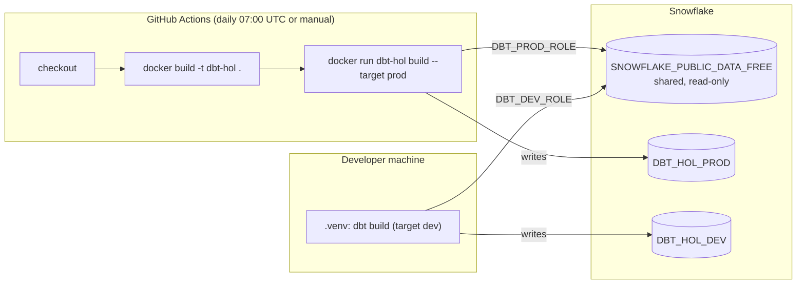
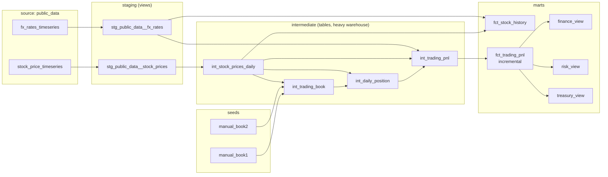

# System Architecture Overview

This document describes how the `dbt_hol` analytics pipeline is built and run: the container that executes it, the Snowflake objects it reads and writes, and the layered transformation design inside the dbt project.

- **Model-by-model reference:** [MODELS_DICTIONARY.md](MODELS_DICTIONARY.md)
- **Setup and day-to-day commands:** [README.md](README.md)

---

## 1. At a glance

The pipeline turns public market data from the Snowflake Marketplace into daily stock history (in USD, EUR and GBP) and a trading profit-and-loss (PnL) mart for two manually maintained trading desks.

| Component | Technology | Where it lives |
|---|---|---|
| Transformations | dbt Core 1.12.5 + dbt-snowflake 1.12.1, dbt_utils 1.4.1 | `dbt_hol/` |
| Warehouse | Snowflake | Account identifier in `SNOWFLAKE_ACCOUNT` |
| Source data | Snowflake Public Data (Free) Marketplace share | `SNOWFLAKE_PUBLIC_DATA_FREE` |
| Runtime image | Docker (`python:3.14-slim`) | `Dockerfile` |
| Scheduler | GitHub Actions, daily at 07:00 UTC | `.github/workflows/dbt-daily.yml` |
| Local development | Python virtual environment | `.venv/`, `requirements.txt` |



The same dbt project runs in two places:

- **Production** runs on GitHub Actions inside the Docker image and writes to `DBT_HOL_PROD`.
- **Development** runs from a local virtual environment and writes to `DBT_HOL_DEV`.

Which environment a run uses is controlled only by the dbt `--target` flag. The SQL is identical.

---

## 2. Containerization (Docker)

### 2.1 Files involved

| File | Role |
|---|---|
| `Dockerfile` | Builds the runtime image: Python, pinned dbt, the project, and its dbt packages. |
| `.dockerignore` | Keeps local and secret files out of the build context. |
| `.github/workflows/dbt-daily.yml` | Builds the image and runs it on a schedule. |
| `dbt_hol/profiles.yml` | Connection profile. It reads every credential from environment variables. |

> **There is no docker-compose setup.** The pipeline is a single short-lived container that connects to a managed warehouse, with no companion services such as a database, scheduler or API. A plain `docker run` is all that's needed.

### 2.2 How the image is built

The `Dockerfile` builds the image in this order:

1. **Base image:** `python:3.14-slim`. It uses the same Python version as local development, so dbt behaves the same in both places.
2. **Environment settings:**
   - `PYTHONUNBUFFERED=1` streams dbt logs to the CI console as they happen.
   - `PIP_NO_CACHE_DIR=1` keeps the image small.
   - `DBT_PROFILES_DIR=/app/dbt_hol` tells dbt to use the `profiles.yml` stored in the project, rather than `~/.dbt`.
3. **Dependencies:** it copies `requirements.txt` and runs `pip install` before copying the project. Because of this order, Docker reuses the cached dependency layer whenever only SQL or YAML files change.
4. **Project and packages:** it copies `dbt_hol/` and runs `dbt deps` at build time, so dbt_utils is part of the image. At runtime, the only network access needed is to Snowflake.
5. **Non-root user:** it creates a user named `dbt`, gives it ownership of `/app`, and switches to it. dbt writes `target/` and `logs/` inside the project folder, which is why the user needs that ownership.
6. **Entrypoint:**
   - `ENTRYPOINT ["dbt"]` makes the container behave like the `dbt` command.
   - `CMD ["build", "--target", "prod"]` is the default command.
   - Any arguments passed to `docker run` replace `CMD`. For example, `docker run ... dbt-hol debug` runs `dbt debug`.

`.dockerignore` excludes:

- `.git`, `.github`, `.venv`, `.env` and `dbt.exe`
- every `target/`, `logs/`, `dbt_packages/` and `__pycache__/` folder

This keeps secrets and local build output out of the image, and makes builds reproducible.

### 2.3 How credentials reach dbt

The image contains **no credentials**. Connection details move through three steps:

```
GitHub repo secrets / local .env
        │  (docker run -e ... / --env-file)
        ▼
container environment variables
        │  (env_var() in profiles.yml)
        ▼
dbt-snowflake connection
```

`profiles.yml` reads three variables:

| Variable | Used for | Required |
|---|---|---|
| `SNOWFLAKE_ACCOUNT` | Account identifier, in the form `<orgname>-<account_name>` | Yes |
| `SNOWFLAKE_USER` | Login user | No. Defaults to `dbt_user` |
| `SNOWFLAKE_PASSWORD` | Password for that user | Yes |

The role, warehouse, database and default schema for each environment are written directly into `profiles.yml` (section 3.2). They aren't secrets, so they don't come from environment variables.

### 2.4 How dbt runs in the container

**On GitHub Actions** (`dbt-daily.yml`):

| Setting | Value |
|---|---|
| Triggers | `schedule: "0 7 * * *"` (daily at 07:00 UTC) and `workflow_dispatch` (the manual "Run workflow" button) |
| Concurrency | The group `dbt-prod` with `cancel-in-progress: false`, so two production runs never overlap. A second run waits for the first to finish. |
| Timeout | 30 minutes |

The job runs these steps:

1. `actions/checkout@v4`.
2. `docker build -t dbt-hol .`
3. Runs the container. The three Snowflake secrets are passed as environment variables, and the container's `target/` folder is mounted to the runner's `./artifacts` folder:
   ```bash
   docker run --rm \
     -e SNOWFLAKE_ACCOUNT -e SNOWFLAKE_USER -e SNOWFLAKE_PASSWORD \
     -v "$PWD/artifacts:/app/dbt_hol/target" \
     dbt-hol build --target prod
   ```
   The `artifacts` folder is made world-writable (`chmod 777`) first, because the container runs as the non-root `dbt` user.
4. Uploads `run_results.json` and `manifest.json` as the `dbt-run-results` artifact. This step runs even if the build fails (`if: always()`), so every run can be inspected afterwards.

**Locally** (with Docker Desktop installed):

```bash
docker build -t dbt-hol .
docker run --rm --env-file .env dbt-hol                     # dbt build --target prod
docker run --rm --env-file .env dbt-hol build --target dev  # any dbt command works
```

`dbt build` runs seeds, models, snapshots and tests in dependency order. If a test fails, dbt skips the models that depend on the failing model, so bad data doesn't spread further.

---

## 3. Snowflake infrastructure

### 3.1 Access objects

These objects are created by hand, once, by an `ACCOUNTADMIN` (the bootstrap script is in section 3.5). dbt never creates or changes roles, users or databases.

| Object | Name | Purpose |
|---|---|---|
| User | `DBT_USER` | Service login used by dbt in every environment. Its default role is `DBT_DEV_ROLE`. |
| Role | `DBT_DEV_ROLE` | Owns everything in `DBT_HOL_DEV` and uses the dev warehouses. |
| Role | `DBT_PROD_ROLE` | Owns everything in `DBT_HOL_PROD` and uses the prod warehouses. |
| Role hierarchy | Both roles are granted to `DBT_USER` and to `SYSADMIN` | Lets `SYSADMIN` see and manage everything dbt builds. |

### 3.2 Compute and storage per environment

| | dev (default target) | prod |
|---|---|---|
| Role | `DBT_DEV_ROLE` | `DBT_PROD_ROLE` |
| Default warehouse | `DBT_DEV_WH` (XSMALL) | `DBT_PROD_WH` (XSMALL) |
| Heavy warehouse | `DBT_DEV_HEAVY_WH` (LARGE) | `DBT_PROD_HEAVY_WH` (LARGE) |
| Target database | `DBT_HOL_DEV` | `DBT_HOL_PROD` |
| Default schema | `PUBLIC` (unused, see 3.3) | `PUBLIC` (unused) |
| Threads | 4 | 4 |

All four warehouses have `AUTO_SUSPEND = 60`, `AUTO_RESUME = TRUE` and `INITIALLY_SUSPENDED = TRUE`. They use credits only while queries are running, plus the 60-second minimum Snowflake bills each time a warehouse resumes.

**Which warehouse each model uses:**

- **Intermediate models** run on the heavy warehouse. They set `+snowflake_warehouse` in `dbt_project.yml`, and the warehouse is picked from `target.name`: `DBT_PROD_HEAVY_WH` for prod, `DBT_DEV_HEAVY_WH` otherwise.
- **All other models and tests** run on the target's default warehouse.
- **`fct_trading_pnl`** also has hooks around its run:
  - A pre-hook resizes the default warehouse to `var('heavy_warehouse_size')`, which defaults to `SMALL`.
  - A post-hook sets it back to `XSMALL`.

### 3.3 Schemas created by dbt

`macros/generate_schema_name.sql` overrides dbt's default schema naming. dbt normally names a custom schema `<target_schema>_<custom>`, for example `PUBLIC_STAGING`. This project uses the custom name on its own. Dev and prod are already separated by database, so the prefix would only add noise.

The schema layout is identical in both databases:

| Schema | Contains | Materialization |
|---|---|---|
| `SEEDS` | `MANUAL_BOOK1`, `MANUAL_BOOK2` | seed tables |
| `STAGING` | `STG_PUBLIC_DATA__STOCK_PRICES`, `STG_PUBLIC_DATA__FX_RATES` | views |
| `INTERMEDIATE` | `INT_STOCK_PRICES_DAILY`, `INT_TRADING_BOOK`, `INT_DAILY_POSITION`, `INT_TRADING_PNL` | tables |
| `MARTS` | `FCT_STOCK_HISTORY`, `FCT_TRADING_PNL`, `FCT_TRADING_PNL_FINANCE_VIEW`, `FCT_TRADING_PNL_RISK_VIEW`, `FCT_TRADING_PNL_TREASURY_VIEW` | tables, one incremental table, views |

### 3.4 Source data

| | |
|---|---|
| Database | `SNOWFLAKE_PUBLIC_DATA_FREE`, an imported Marketplace database (read-only) |
| Schema | `PUBLIC_DATA_FREE`. All objects are secure views. |
| Views used | `STOCK_PRICE_TIMESERIES` (daily Nasdaq prices and volume per ticker, long format) and `FX_RATES_TIMESERIES` (daily rates per currency pair) |
| Access | `GRANT IMPORTED PRIVILEGES` to both dbt roles. Shared databases don't accept ordinary `USAGE` or `SELECT` grants. |
| Freshness | The free listing runs about three months behind. When this was written, the latest date was 2026-07-02. |

> **History:** the original Snowflake quickstart guide used the *Knoema Economy Data Atlas* listing, which is no longer on the Marketplace. Cybersyn's *Financial & Economic Essentials* was renamed **Snowflake Public Data (Free)** after Snowflake acquired Cybersyn, and this project uses that listing. `FX_RATES_TIMESERIES` replaces Knoema's `exratescc2018`, and `STOCK_PRICE_TIMESERIES` replaces `usindssp2020`. Other databases installed in the account (`CEIC_WORLD_MACRO_ECONOMIC_DATA`, `INDUSTRYBASED_ECONOMIC_LEADING_INDICATORS`) don't contain FX or stock price data and aren't used.

### 3.5 Bootstrap script

Run this once per Snowflake account as `ACCOUNTADMIN`. It is safe to run again: it uses `IF NOT EXISTS`, so it never drops objects or data. Replace the password placeholder before running it.

```sql
USE ROLE accountadmin;

CREATE ROLE IF NOT EXISTS dbt_dev_role;
CREATE ROLE IF NOT EXISTS dbt_prod_role;
CREATE USER IF NOT EXISTS dbt_user PASSWORD = '<strong-password>' DEFAULT_ROLE = dbt_dev_role;

-- GRANT ROLE accepts one role per statement
GRANT ROLE dbt_dev_role  TO USER dbt_user;
GRANT ROLE dbt_prod_role TO USER dbt_user;
GRANT ROLE dbt_dev_role  TO ROLE sysadmin;
GRANT ROLE dbt_prod_role TO ROLE sysadmin;

-- Marketplace source (install "Snowflake Public Data (Free)" first)
GRANT IMPORTED PRIVILEGES ON DATABASE snowflake_public_data_free TO ROLE dbt_dev_role;
GRANT IMPORTED PRIVILEGES ON DATABASE snowflake_public_data_free TO ROLE dbt_prod_role;

USE ROLE sysadmin;

CREATE WAREHOUSE IF NOT EXISTS dbt_dev_wh        WITH WAREHOUSE_SIZE = 'XSMALL' AUTO_SUSPEND = 60 AUTO_RESUME = TRUE INITIALLY_SUSPENDED = TRUE;
CREATE WAREHOUSE IF NOT EXISTS dbt_dev_heavy_wh  WITH WAREHOUSE_SIZE = 'LARGE'  AUTO_SUSPEND = 60 AUTO_RESUME = TRUE INITIALLY_SUSPENDED = TRUE;
CREATE WAREHOUSE IF NOT EXISTS dbt_prod_wh       WITH WAREHOUSE_SIZE = 'XSMALL' AUTO_SUSPEND = 60 AUTO_RESUME = TRUE INITIALLY_SUSPENDED = TRUE;
CREATE WAREHOUSE IF NOT EXISTS dbt_prod_heavy_wh WITH WAREHOUSE_SIZE = 'LARGE'  AUTO_SUSPEND = 60 AUTO_RESUME = TRUE INITIALLY_SUSPENDED = TRUE;

-- ALL includes MODIFY, which the fct_trading_pnl resize hooks need
GRANT ALL ON WAREHOUSE dbt_dev_wh        TO ROLE dbt_dev_role;
GRANT ALL ON WAREHOUSE dbt_dev_heavy_wh  TO ROLE dbt_dev_role;
GRANT ALL ON WAREHOUSE dbt_prod_wh       TO ROLE dbt_prod_role;
GRANT ALL ON WAREHOUSE dbt_prod_heavy_wh TO ROLE dbt_prod_role;

CREATE DATABASE IF NOT EXISTS dbt_hol_dev;
CREATE DATABASE IF NOT EXISTS dbt_hol_prod;
GRANT ALL ON DATABASE dbt_hol_dev  TO ROLE dbt_dev_role;
GRANT ALL ON DATABASE dbt_hol_prod TO ROLE dbt_prod_role;
GRANT ALL ON ALL SCHEMAS IN DATABASE dbt_hol_dev  TO ROLE dbt_dev_role;
GRANT ALL ON ALL SCHEMAS IN DATABASE dbt_hol_prod TO ROLE dbt_prod_role;
```

> Avoid `CREATE OR REPLACE` for these objects. Replacing a role removes its grants, and replacing a user resets the password.

---

## 4. dbt data layering

### 4.1 Layers



The `i1 --> i2` edge is a test dependency only: the `relationships` test on `int_trading_book.instrument` references `int_stock_prices_daily`.

| Layer | Folder | Default materialization | Responsibility | Rules |
|---|---|---|---|---|
| **Sources** | `models/staging/_sources.yml` | n/a | Declares the Marketplace views as dbt sources. | Only staging models may call `source()`. |
| **Seeds** | `seeds/` | table in `SEEDS` | Small, manually maintained reference data (the trading desks' trades). | Version-controlled CSVs. Column types are fixed in `_seeds.yml`. |
| **Staging** | `models/staging/` | view | One model per source object. Renames columns, filters to the load window and the needed currencies. | No joins and no aggregation. Views add no storage and always show current source data. |
| **Intermediate** | `models/intermediate/` | table on the heavy warehouse | Business logic: pivoting, unions, building the daily position calendar, marking positions to market. | Built as tables, because several models and tests read each one and the pivot is expensive to repeat. |
| **Marts** | `models/marts/` | table (`fct_trading_pnl` is incremental, the department models are views) | Consumer-facing facts and departmental views. | Stable column names and grain. This is what BI tools and analysts query. |

Naming conventions:

- Staging models are named `stg_<source>__<entity>`, with a double underscore between source and entity.
- Intermediate models are named `int_<entity>`.
- Facts are named `fct_<entity>`, and departmental views `fct_<entity>_<department>_view`.

### 4.2 Project-level configuration (`dbt_project.yml`)

| Variable | Default | Effect |
|---|---|---|
| `start_date` | `'2025-01-01'` | Lower date bound applied in staging. Controls data volume and cost. |
| `report_currencies` | `['EUR', 'GBP']` | Currencies loaded from FX staging. `fct_stock_history` gets a column pair for each one. |
| `pnl_lookback_days` | `7` | How many trailing days `fct_trading_pnl` re-merges on each incremental run. |
| `heavy_warehouse_size` | `'SMALL'` | Size the `fct_trading_pnl` pre-hook resizes the warehouse to. The original guide uses `XXLARGE`. |

Override a variable for a single run with `--vars`:

```bash
dbt build --vars '{start_date: "2024-01-01"}'
```

### 4.3 Cross-cutting behaviour

**Query tagging.** `macros/query_tag.sql` overrides dbt-snowflake's `snowflake__set_query_tag` and `snowflake__unset_query_tag`.

- **What it does:** before each model, seed or test runs, the session's `QUERY_TAG` is set to `dbt_hol.<node_name>`. Afterwards it is reset to its previous value.
- **Why it's needed:** the built-in macros only tag queries when `query_tag` is set in a node's config.
- **What you get:** every query in Snowflake's Query History can be traced back to the model or test that issued it.
- **Override:** an explicit `query_tag` in a model's config still takes precedence.

**Schema naming.** `macros/generate_schema_name.sql` (see section 3.3).

**Packages.** `dbt_utils` is used for:

- `union_relations` in `int_trading_book`
- `unique_combination_of_columns` for grain tests
- `expression_is_true` for range checks

`package-lock.yml` pins the resolved version, 1.4.1.

### 4.4 Execution order and failure behaviour

`dbt build` runs every node in dependency order: seeds, then models, each followed by its tests. If a test fails on a model, dbt skips that model's downstream nodes in the same run.

For example, two source rows once had a volume but no prices. When they reached `int_stock_prices_daily`, its `not_null` test failed and `fct_stock_history` was skipped, so the incomplete rows never reached the mart. Those rows are now filtered out in the model itself.

---

## 5. Operational notes and known limitations

- **Source lag:** the free listing ends about three months before today. Date windows come from `var('start_date')` and never from `current_date`, so "recent" filters don't come back empty.
- **Incremental fact and historical edits:** `fct_trading_pnl` only re-merges the last `pnl_lookback_days` days. After editing an older trade in a seed CSV, rebuild it once with `dbt build --full-refresh -s fct_trading_pnl`.
- **Warehouse resize hooks:** the post-hook that resets the warehouse to `XSMALL` only runs if `fct_trading_pnl` succeeds. If that model fails, the default warehouse stays at `heavy_warehouse_size` until the next successful run or a manual `ALTER WAREHOUSE`.
- **Heavy warehouse cost:** every run resumes a LARGE warehouse for the intermediate layer, which bills at least 60 seconds at 8 credits per hour. Remove `+snowflake_warehouse` in `dbt_project.yml` to keep everything on XSMALL.
- **Authentication:** `DBT_USER` signs in with a password. Snowflake is phasing out single-factor password sign-ins, so plan to move to key-pair authentication (`private_key_path` / `private_key` in `profiles.yml`) before that applies to this account.
- **Secrets:** credentials live only in GitHub repository secrets, a local `.env` (git-ignored and excluded from Docker builds) or user environment variables. They never appear in the image, `profiles.yml`, or git history.
